<!-- ══════════════════════════════════════════════════════════════
   README.md — GitHub Profile: ikmalhanaan / HanzCodedDrop
   🎨 Theme : Dark Cyberpunk Minimalist  |  FINAL VERSION
   
   PENTING: Commit 3 file ke root repo ikmalhanaan/ikmalhanaan:
   ├── README.md   ← ini
   ├── header.svg  ← file header cyberpunk
   └── footer.svg  ← file footer cyberpunk
   ══════════════════════════════════════════════════════════════ -->

<!-- ░░░ CYBERPUNK HEADER (custom animated SVG) ░░░ -->
<p align="center">
  
</p>

<br>

---

<!-- ░░░ ABOUT ME ░░░ -->
<h2 align="center">👾 About Me</h2>

```yaml
Name      : HanzCodedDrop
Username  : ikmalhanaan
Focus     : Fullstack Development + Ethical Hacking / Penetration Testing
Currently : Building Web & Mobile Apps | Practicing CTF Challenges
Interests : Bug Bounty | Red Teaming | App Security | Open Source
Motto     : "Hack to learn, build to defend."
```

---

<!-- ░░░ TECH STACK BADGES ░░░ -->
<h2 align="center">⚙️ Tech Stack</h2>

<!-- 🌐 WEB DEVELOPMENT -->
<h3 align="center">🌐 Web Development</h3>
<p align="center">
  
  
  
  
  
  
  
  
  
  
  
</p>

<!-- 📱 MOBILE DEVELOPMENT -->
<h3 align="center">📱 Mobile Development</h3>
<p align="center">
  
  
  
  
  
</p>

<!-- 🔐 CYBER SECURITY -->
<h3 align="center">🔐 Cyber Security Tools</h3>
<p align="center">
  
  
  
  
  
  
  
  
</p>

---

<!-- ░░░ ROLLING SKILL ICON TABLE ░░░ -->
<h2 align="center">🚀 Rolling Stack</h2>

<div align="center">
  <table>
    <tr>
      <td align="center" width="100">
        
        <br><sub><b>HTML5</b></sub>
      </td>
      <td align="center" width="100">
        
        <br><sub><b>CSS3</b></sub>
      </td>
      <td align="center" width="100">
        
        <br><sub><b>JavaScript</b></sub>
      </td>
      <td align="center" width="100">
        
        <br><sub><b>TypeScript</b></sub>
      </td>
      <td align="center" width="100">
        
        <br><sub><b>React</b></sub>
      </td>
      <td align="center" width="100">
        
        <br><sub><b>Next.js</b></sub>
      </td>
      <td align="center" width="100">
        
        <br><sub><b>Node.js</b></sub>
      </td>
      <td align="center" width="100">
        
        <br><sub><b>Laravel</b></sub>
      </td>
    </tr>
    <tr>
      <td align="center" width="100">
        
        <br><sub><b>Flutter</b></sub>
      </td>
      <td align="center" width="100">
        
        <br><sub><b>Dart</b></sub>
      </td>
      <td align="center" width="100">
        
        <br><sub><b>Python</b></sub>
      </td>
      <td align="center" width="100">
        
        <br><sub><b>Bash</b></sub>
      </td>
      <td align="center" width="100">
        
        <br><sub><b>Linux</b></sub>
      </td>
      <td align="center" width="100">
        
        <br><sub><b>MySQL</b></sub>
      </td>
      <td align="center" width="100">
        
        <br><sub><b>Firebase</b></sub>
      </td>
      <td align="center" width="100">
        
        <br><sub><b>Git</b></sub>
      </td>
    </tr>
  </table>
</div>

---

<!-- ░░░ GITHUB STATS ░░░ -->
<h2 align="center">📊 GitHub Statistics</h2>

<!-- GitHub Profile Trophy — tidak butuh PAT, sangat reliable -->
<p align="center">
  
</p>

<!-- GitHub Streak — demolab.com stabil -->
<p align="center">
  
</p>

<!-- Language & Commit stats via shields.io — 100% reliable, no API token needed -->
<p align="center">
  
  &nbsp;
  
  &nbsp;
  
</p>

---

<!-- ░░░ CONTRIBUTION ACTIVITY GRAPH ░░░ -->
<h2 align="center">📈 Contribution Activity</h2>

<p align="center">
  
</p>

---

<!-- ░░░ CTF PLATFORMS ░░░ -->
<h2 align="center">🏴 CTF &amp; Hacking Platforms</h2>

<p align="center">
  <a href="https://tryhackme.com/p/ikmalhanaan" target="_blank">
    <!-- ⚠️ EDIT: Ganti "ikmalhanaan" dengan username TryHackMe kamu -->
    
  </a>
  &nbsp;
  <a href="https://app.hackthebox.com/profile/0" target="_blank">
    <!-- ⚠️ EDIT: Ganti "0" dengan ID numerik profil HTB kamu (cek di URL profil HTB) -->
    
  </a>
  &nbsp;
  <a href="https://play.picoctf.org/users/ikmalhanaan" target="_blank">
    <!-- ⚠️ EDIT: Ganti "ikmalhanaan" dengan username PicoCTF kamu -->
    
  </a>
</p>

<!-- TryHackMe Badge — uncomment setelah dapat badge URL dari dashboard THM -->
<!--
<p align="center">
  
</p>
-->

---

<!-- ░░░ PORTFOLIO & SOCIAL LINKS ░░░ -->
<h2 align="center">🌐 Portfolio &amp; Social Links</h2>

<p align="center">
  <a href="https://your-portfolio-website.com" target="_blank">
    <!-- ⚠️ EDIT: Ganti URL dengan website portofolio kamu -->
    
  </a>
  &nbsp;
  <a href="https://linkedin.com/in/ikmalhanaan" target="_blank">
    <!-- ⚠️ EDIT: Ganti "ikmalhanaan" dengan username LinkedIn kamu -->
    
  </a>
  &nbsp;
  <a href="https://instagram.com/ikmalhanaan" target="_blank">
    <!-- ⚠️ EDIT: Ganti "ikmalhanaan" dengan username Instagram kamu -->
    
  </a>
  &nbsp;
  <a href="mailto:youremail@gmail.com" target="_blank">
    <!-- ⚠️ EDIT: Ganti "youremail@gmail.com" dengan email kamu -->
    
  </a>
</p>

---

<!-- ░░░ FEATURED PROJECTS ░░░ -->
<h2 align="center">📌 Featured Projects</h2>

<div align="center">
<table>
  <tr>
    <td width="50%" valign="top">
      <h3><a href="https://github.com/ikmalhanaan/Postwigger-SQL-Injection">🔐 Postwigger-SQL-Injection</a></h3>
      <p>SQL Injection labs from PortSwigger Web Academy</p>
      <p>
        
        
        <br/>
        
      </p>
    </td>
    <td width="50%" valign="top">
      <h3><a href="https://github.com/ikmalhanaan/TryHackMe-Overpass">🏴 TryHackMe-Overpass</a></h3>
      <p>CTF Writeups - TryHackMe Overpass series</p>
      <p>
        
        
        <br/>
        
      </p>
    </td>
  </tr>
  <tr>
    <td width="50%" valign="top">
      <h3><a href="https://github.com/ikmalhanaan/DVWA-Practice">🛡️ DVWA-Practice</a></h3>
      <p>Damn Vulnerable Web App — vulnerability practice notes</p>
      <p>
        
        
        <br/>
        
      </p>
    </td>
    <td width="50%" valign="top">
      <h3><a href="https://github.com/ikmalhanaan/PicoCTF">🏆 PicoCTF</a></h3>
      <p>PicoCTF challenge writeups &amp; solutions</p>
      <p>
        
        
        <br/>
        
      </p>
    </td>
  </tr>
</table>
</div>

---

<!-- ░░░ VISITOR COUNTER & FOLLOWERS ░░░ -->
<p align="center">
  
  &nbsp;
  
</p>

---

<!-- ░░░ SNAKE ANIMATION ░░░ -->
<!-- SETUP: Buat file .github/workflows/snake.yml di repo ini, isi dengan snake.yml yang disertakan.
     Lalu buka tab Actions → Run workflow → tunggu selesai. Snake akan muncul otomatis. -->
<h2 align="center">🐍 Contribution Snake</h2>

<p align="center">
  <picture>
    <source media="(prefers-color-scheme: dark)"
      srcset="https://raw.githubusercontent.com/ikmalhanaan/ikmalhanaan/output/github-snake-dark.svg"/>
    <source media="(prefers-color-scheme: light)"
      srcset="https://raw.githubusercontent.com/ikmalhanaan/ikmalhanaan/output/github-snake.svg"/>
    
  </picture>
</p>

---

<!-- ░░░ CYBERPUNK FOOTER (custom animated SVG) ░░░ -->
<p align="center">
  
</p>

<p align="center">
  <i>"The quieter you become, the more you are able to hear." — Kali Linux</i>
</p>
